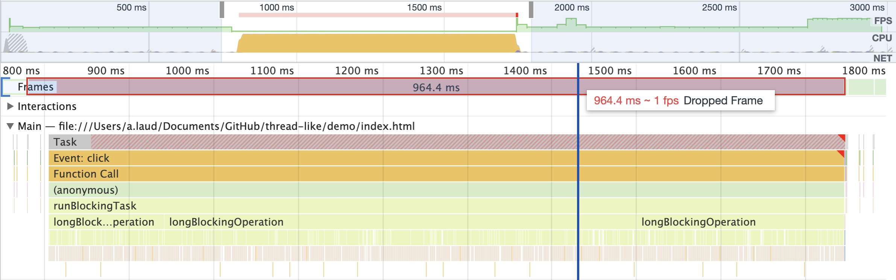
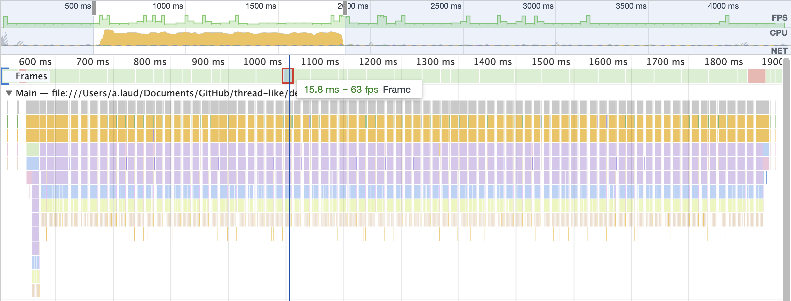
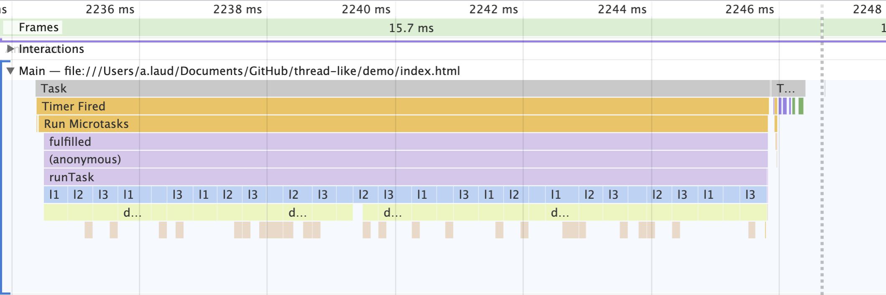

# Thread-like

Утилита, позволяющая распараллеливать синхронные функции, обеспечивая высокую частоту кадров.

[](https://badge.fury.io/js/thread-like)

## Установка

```bash
npm install thread-like
```

## Зачем?

Допустим, в ответ на действие пользователя нужно посчитать какой-то большой объем данных. Если этот процесс будет занимать больше 16 миллисекунд (столько нужно, чтобы хватило времени на рендер 60 кадров в секунду), пользователь может заметить задержки. При больших значениях (200+) страница и вовсе будет восприниматься, как "зависшая".

В качестве примера можно взять такой код:

```javascript
function longBlockingOperation() {
  let count = 0;
  while (count++ < 2500) {
    doSmth(); // Какие-то операции на 0.1 – 0.5 миллисекунды
  }
}
```

Если его просто запустить, страница заблокируется примерно на секунду. Достаточно, чтобы подумать, что с сервисом что-то не так.

Профайлер покажет примерно такой результат: на 964 миллисекунды поток выполнения заблокирован задачей `longBlockingOperation`.



## Решение

Пакет `thread-like` позволяет с минимальными изменениями кода сделать такую функцию

- не блокирующей поток выполнения
- прерываемой
- выполняемой параллельно с другими подобными задачами

Выполнение будет разбиваться на небольшие части:



### Параллельное выполнение

Для параллельного выполнения не требуется никаких дополнительных действий. Исполнитель будет запускать части всех задач поочередно, создавая подобие параллельности: здесь задачи `l1`, `l2` и `l3` выполняются одновременно.



## Demo

- [Обычное синхронное vs параллельное выполнение](http://htmlpreview.github.io/?https://github.com/kshshe/thread-like/blob/master/demo/index.html)

## API

### Создание параллельной функции (`parallelize`)

```javascript
import { parallelize } from "thread-like";

const longNonBlockingOperation = parallelize(function* longBlockingOperation() {
  let count = 0;
  while (count++ < 2500) {
    yield doSmth();
  }
  return count;
});
```

1. Функцию нужно сделать генератором (`function*`, [подробнее](https://developer.mozilla.org/ru/docs/Web/JavaScript/Reference/Statements/function*))
2. В местах, где планировщику можно будет остановиться, чтобы дать браузеру время на рендер, нужно разместить оператор `yield`

> `yield`'ов не должно быть слишком много. Идеально, если между двумя `yield` будет проходить хотя бы 0.1 миллисекунды. В противном случае на переключение и контроль времени будет уходить больше ресурсов, и выполнение задачи замедлится в разы.

Теперь вызов `longNonBlockingOperation` будет запускать блокирующую операцию, и приостанавливать её в `yield` тогда, когда время, выдаваемое на блокировку (13 миллисекунд), истекло.

### Подписка на результат выполнения (`task`)

```javascript
const task1 = longNonBlockingOperation();
const task2 = await longNonBlockingOperation();
```

Созданная в `parallelize` функция возвращает промис, который будет разрешен тогда, когда выполнение задачи дойдет до конца. В результат промиса попадет значение, возвращенное функцией.

Дополнительно к интерфейсу промиса, у таски будет метод `abort` для её остановки.

### Отмена выполнения (`abort`)

```javascript
task.abort(resolve);
```

Остановит выполнение таски, промис перейдет в состояние `fullfilled` или `rejected` в зависимости от параметра `resolve` (по умолчанию `true`). Значением в обработчике будет символ `Aborted`:

```javascript
import { Aborted, isAborted } from 'thread-like';
...
try {
	const task = await runTask();
} catch (e) {
  if (!isAborted(e)) { // Или e !== Aborted
    // Обработка ошибки
  }
}
```

## TODO

- Дебаг-инструменты для отслеживания того, оптимально ли размечены функции
